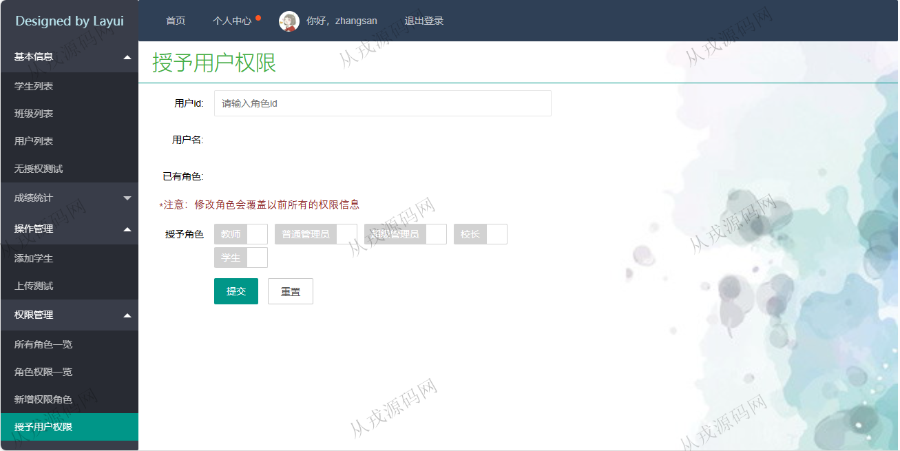

<h1 align="center">148.学生信息管理系统</h1>

 获取sql文件 QQ: 386869957 QQ群: 377586148 

 [更多源码项目: 从戎源码网](https://armycodes.com/) 

## 简介

> 本代码来源于网络,仅供学习参考使用!
>
> 提供1.远程部署/2.修改代码/3.设计文档指导/4.框架代码讲解等服务
> 
> 访问地址：http://localhost:8080/login
> 
> 管理员：zhangsan 123
> 
> 教师：teacher 123
> 
> 学生：student 123
> 
>

## 项目介绍
基于springboot的学生信息管理系统：前端 html、jquery、layui，后端 maven、springmvc、spring、mybatis；角色分为：管理员、教师、学生；集成学生、班级列表、成绩统计列表等功能于一体的系统。

## 功能介绍

- 基本功能：登录、注册、退出
- 学生列表：学生信息的增删改查，照片上传
- 班级列表：班级信息的增删改查
- 用户列表：用户信息的增删改查
- 成绩统计：我的成绩，班级成绩的增删改查
- 权限管理：所有角色一览，角色权限一览，新增权限角色，授予用户权限

## 环境

- <b>IntelliJ IDEA 2021.3</b>

- <b>Mysql 5.7.26</b>

- <b>Tomcat 7.0.73</b>

- <b>JDK 1.8</b>

## 运行截图

